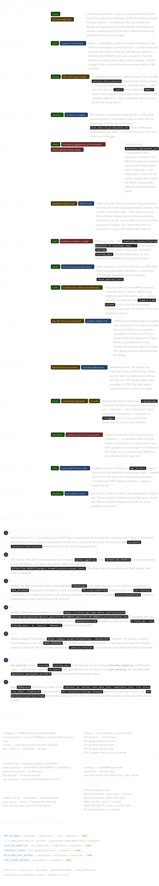
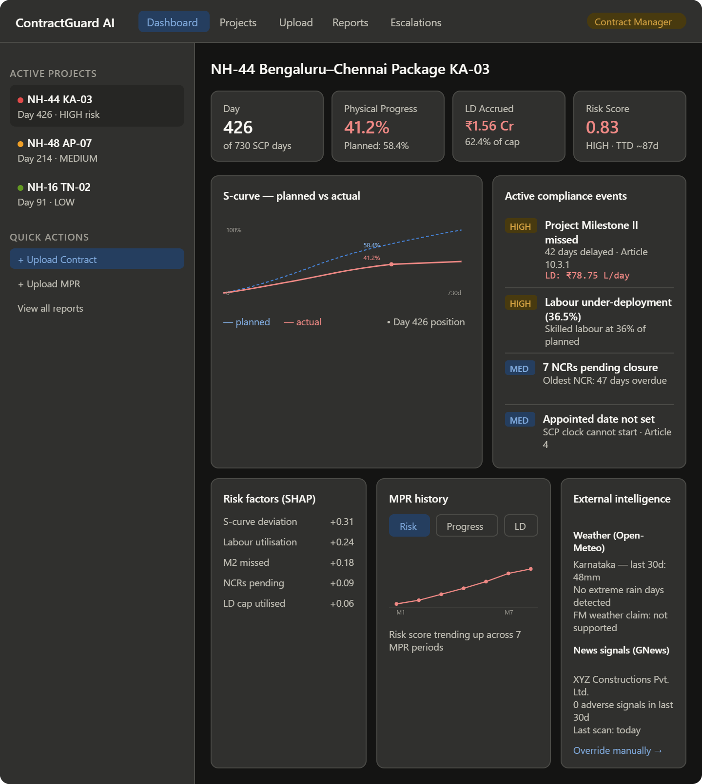

Code audit findings — the honest summary
The backend is genuinely solid. The compliance engine (15 checks), the parser architecture, the escalation state machine, and the Groq client are all production-quality code. The problems are specific and fixable:
Three real bugs: the eot_agent.py overlap variable crash, the FM regex returning None always, and the machinery deployment hardcode. These will silently produce wrong results in production.
The orchestrator is fake. It calls Groq to decide what agents to run, but api/main.py ignores that decision entirely and hardcodes the same sequence. LangGraph fixes this properly — real conditional routing, typed state, and the ability to resume a partial run if Groq rate-limits mid-pipeline.
The weather tool is calling a paid OWM endpoint and falling back to random numbers regardless. Open-Meteo is the right replacement — completely free, no key, real historical daily precipitation data for any coordinates worldwide.
The EXTRACTION_PROMPTS dict in parser_agent.py is a well-written set of per-field JSON schema prompts that nobody wired up. The LLM fallback sends a generic prompt instead. Connecting them is a 5-line change that makes parsing dramatically more reliable on non-standard contract formats.

For the migration, I'd suggest doing it in this order:
First, fix the 3 bugs immediately — they're one-liners and affect current testing. Second, swap the weather and news tools — Open-Meteo needs no key and works today. Third, add the MPRRecord history table — without it the React charts have nothing to show. Fourth, build the React frontend against the existing API, then wire LangGraph as the final step since it's the biggest refactor.